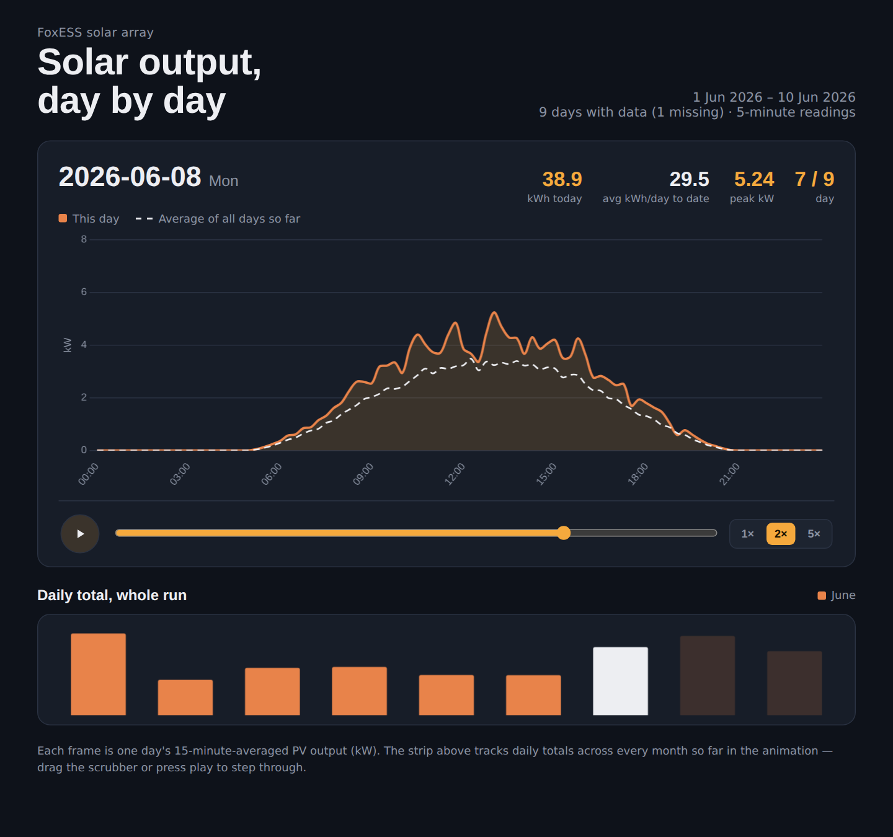

# FoxESS solar animation

Turn your FoxESS inverter history into a single, self-contained web page that **animates solar generation day by day**. Step through every day in your data, watch each day's output curve against the running average, and see how daily totals change from month to month.



*Screenshot generated from the synthetic data in [`examples/`](examples/).*

## What you get

- **One frame per day** – the day's `pvPower` curve in 15-minute averages, with the day's kWh total and peak kW.
- **Running average line** – a dashed line showing the average output curve of every day up to the one on screen. It updates as the animation advances, alongside an "avg kWh/day to date" figure.
- **Whole-run strip** – daily totals as a bar chart, coloured by month, filling in as the animation plays.
- **Playback controls** – play/pause, a scrubber to jump to any day, and 1×/2×/5× speed.
- **Header that describes your data** – date range and number of days, plus how many calendar days have no data if there are gaps, e.g. `27 Jul 2026 – 30 Sep 2026 · 66 days`.
- **Light and dark themes** that follow your system setting.

The output is a single `.html` file you can open locally, host anywhere, or share.

## Quick start

```bash
git clone https://github.com/<your-username>/foxess-solar-animation.git
cd foxess-solar-animation
pip install -r requirements.txt

python solar_animation.py examples/sample_synthetic.csv --open
```

Then point it at your own exports:

```bash
python solar_animation.py history/            # every .csv in a folder
python solar_animation.py jul.csv aug.csv sep.csv -o summer.html
python solar_animation.py history/ --ymax 9 --label "Home array" --open
```

Requires Python 3.9+ and `pandas`. The generated page loads Chart.js and web fonts from a CDN, so it needs an internet connection when you open it.

### Adding new months

Drop the new month's CSV into the same folder and run the script again. Nothing else to change: the date range, day count, month legend and colours all come from the data.

## Options

| Option | Default | Description |
|---|---|---|
| `inputs` | – | One or more CSV files and/or folders containing CSVs |
| `-o`, `--output` | `solar_output_animation.html` | Where to write the page |
| `--ymax` | `8` | Fixed y-axis maximum in kW. Set it to your array's expected peak so frames are comparable. The script warns if any points exceed it |
| `--label` | `FoxESS solar array` | Small caption above the title |
| `--open` | off | Open the result in your default browser |

## Input format

Any CSV with these two columns works; others are ignored:

```csv
time,pvPower,loadsPower,feedinPower,...
2026-09-01 00:00:45 BST+0100,0.0,0.378,0.0,...
2026-09-01 00:05:45 BST+0100,0.0,0.382,0.0,...
```

- `time` – `YYYY-MM-DD HH:MM:SS` followed by a timezone abbreviation and UTC offset (`BST+0100`, `GMT+0000`).
- `pvPower` – PV generation in **kW**.

This is the layout of FoxESS history exports. Rows without a valid timestamp or power value are skipped. File names don't matter, because dates come from the timestamps. Files may overlap (for example a partial and a full export of the same month): duplicate readings are dropped.

## How it works

- **Frames:** readings are averaged into 15-minute slots per day (96 per day) using local wall-clock time.
- **Daily kWh:** each reading's power is weighted by the real time until the next reading, so irregular logging intervals don't skew the totals. A gap longer than 10 minutes is capped rather than extrapolated, so outages don't invent energy.
- **Clock changes:** readings are ordered and de-duplicated by their true UTC instant. When clocks go back in October, both passes of the repeated hour are kept.
- **Month colours:** each month gets its own colour in order of appearance. Once data spans more than one calendar year, labels include the year (`July 2026`, `July 2027`). There are 12 distinct colours, which repeat after that.
- **Running average:** for each 15-minute slot, the mean kW over all days from the start of the dataset up to the current frame.

## Things to know

- Totals cover **PV generation only** (`pvPower`). Load, grid and battery columns aren't used.
- A first or last day with partial logging (for example an export that starts mid-morning) will show a low total and pull the early running daily average down slightly.
- Everything runs locally; your CSVs are never uploaded anywhere. The page itself fetches Chart.js and fonts from public CDNs when opened.
- **Keep your data out of the repo.** `.gitignore` excludes `*.csv` except the synthetic sample, and generated `.html` files.

## Development

```bash
pip install -r requirements-dev.txt
pytest -q
```

The tests cover timezone parsing, overlapping files, the clock-change hour, time-weighted kWh, month labelling and the CLI. CI runs them on Python 3.9 and 3.12 (`.github/workflows/tests.yml`).

The HTML/JS page is embedded in `solar_animation.py` as `TEMPLATE`, with `__DATA_JSON__`, `__YMAX__` and `__KICKER__` placeholders, so the tool stays a single dependency-light file.

## Licence

[MIT](LICENSE)
